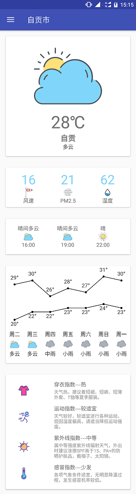
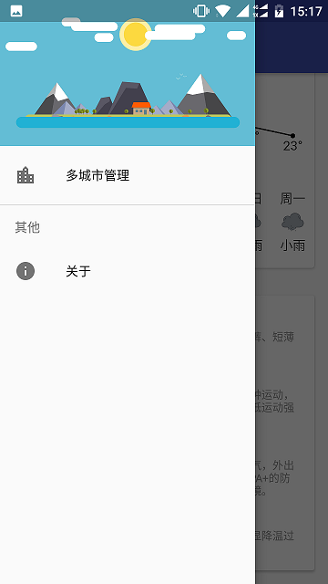
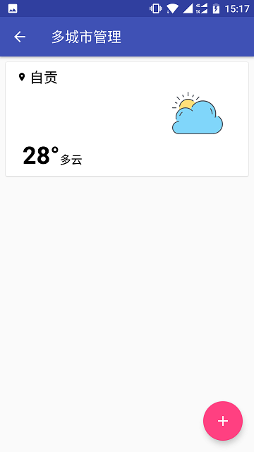
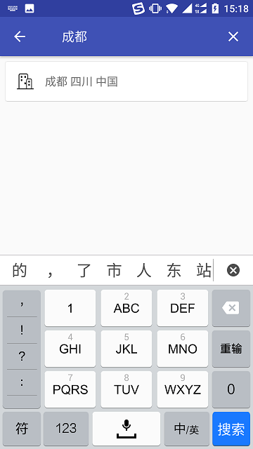
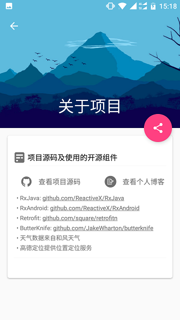

# 简单天气

一款非常清新、简洁的天气应用，带给你最清爽、直观的天气信息。你要天气，我就只给你天气!其他乱七八糟的统统抛开!
***

### 简介
该应用是一款遵循Material Design卡片风格的天气APP。

* 卡片展示（当前天气情况，未来几小时的天气状况，未来7天天气预测，生活指数）
* 简单的桌面小部件

---

### 权限说明----高德定位所需
```
	<!-- 用于进行网络定位 -->
    <uses-permission android:name="android.permission.ACCESS_COARSE_LOCATION"/>
    <!-- 用于访问GPS定位 -->
    <uses-permission android:name="android.permission.ACCESS_FINE_LOCATION"/>
    <!-- 获取运营商信息，用于支持提供运营商信息相关的接口 -->
    <uses-permission android:name="android.permission.ACCESS_NETWORK_STATE"/>
    <!-- 用于访问wifi网络信息，wifi信息会用于进行网络定位 -->
    <uses-permission android:name="android.permission.ACCESS_WIFI_STATE"/>
    <!-- 这个权限用于获取wifi的获取权限，wifi信息会用来进行网络定位 -->
    <uses-permission android:name="android.permission.CHANGE_WIFI_STATE"/>
    <!-- 用于访问网络，网络定位需要上网 -->
    <uses-permission android:name="android.permission.INTERNET"/>
    <!-- 用于读取手机当前的状态 -->
    <uses-permission android:name="android.permission.READ_PHONE_STATE"/>
    <!-- 写入扩展存储，向扩展卡写入数据，用于写入缓存定位数据 -->
    <uses-permission android:name="android.permission.WRITE_EXTERNAL_STORAGE"/> 
```
### 应用截图
     

### 下载地址


酷安：[酷安地址](http://www.coolapk.com/apk/xyz.lovemma.weatherdemo)

### 项目技术
>- 天气API：和风天气
>- 定位：高德定位
>- [Retrofit](https://github.com/square/retrofit)
>- [Rxjava](https://github.com/ReactiveX/RxJava)
>- [RxAndroid](https://github.com/ReactiveX/RxAndroid)
>- [ButterKnife](https://github.com/JakeWharton/butterknife)

### License
```
   Copyright 2017 Lovemma

   Licensed under the Apache License, Version 2.0 (the "License");
   you may not use this file except in compliance with the License.
   You may obtain a copy of the License at

       http://www.apache.org/licenses/LICENSE-2.0

   Unless required by applicable law or agreed to in writing, software
   distributed under the License is distributed on an "AS IS" BASIS,
   WITHOUT WARRANTIES OR CONDITIONS OF ANY KIND, either express or implied.
   See the License for the specific language governing permissions and
   limitations under the License.
```